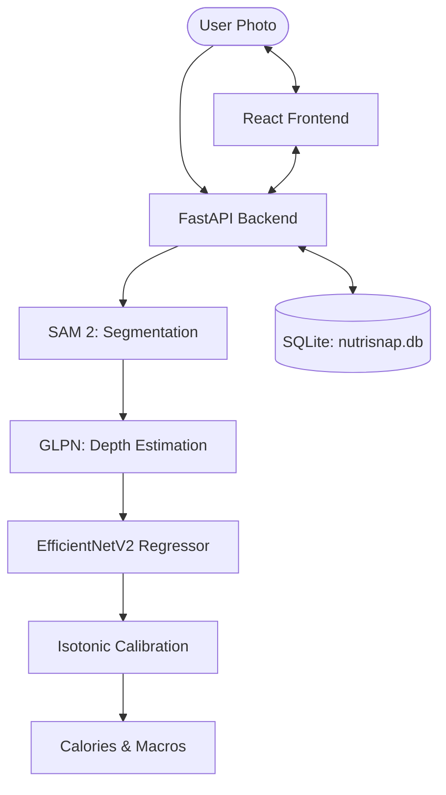

# NutriSnap 🍱

**AI-powered nutrition companion for personalized fitness and healthy living.**

NutriSnap is a comprehensive nutrition tracking platform that uses an advanced AI ensemble to estimate calories and macros from a single photo. It combines state-of-the-art computer vision with a personalized user experience, featuring offline-first logging, interactive progress dashboards, and an intelligent meal planner.

---

## 🏗️ Architecture & AI Pipeline



NutriSnap employs a **three-tier, 3D-aware pipeline** to ensure high-accuracy detection and mass estimation even for rare food items or difficult lighting.

### 🧠 The Three-Tier Detection Strategy

1.  **Tier 1: Specialized YOLOv8** — Our primary detector targets common dishes with high speed and precision. If YOLO finds food with confidence > 0.5, we proceed directly to segmentation.
2.  **Tier 2: OWL-ViT Zero-Shot Fallback** — If YOLO fails (e.g., unusual lighting or rare dishes like 'biryani'), the system automatically triggers a Zero-Shot detector using text queries. This ensures we can detect virtually any food type.
3.  **Tier 3: LLM Validation & Realism Check** — All detections are filtered through a Gemini-powered validator to remove non-food items (furniture, pets) and ensure nutritional estimates are physically plausible.

### 🔬 High-Resolution Optimizations

-   **Enhanced Preprocessing**: Every image undergoes automated sharpening and **CLAHE (Contrast Limited Adaptive Histogram Equalization)** to recover texture details from mobile photos.
-   **Tiled Inference**: For high-resolution uploads, the system uses an overlapping tile strategy for Zero-Shot detection, ensuring small food items (like peas in a pulao) are not missed due to downscaling.
-   **Volumetric Reconstruction**: Combines **SAM 2** (Segmentation) and **GLPN** (Depth Estimation) to recover 3D volume from a single 2D photo.

### 🧠 Trained Models vs. Pre-trained Weights

-   **Pre-trained Weights (SAM 2, GLPN)**: These are the "eyes" of the system. They use massive weights pre-trained on millions of images to provide general spatial and object understanding (segmentation and depth). We leverage these for their state-of-the-art accuracy in understanding *what* and *where* objects are.
-   **Trained Models (EfficientNetV2 Regressor)**: This is the specialized "brain" of the system. We have specifically trained this model on the NutriSnap dataset (e.g., Nutrition5k) to map visual features and depth maps to actual nutritional mass. It understands the density and caloric content of specific food items.

---

## ✨ Key Features

-   **📸 AI Food Scanning**: Real-time nutrition estimation (Calories, Protein, Carbs, Fat) from a single meal photo.
-   **📊 Progress Dashboard**: Interactive visualizations of your 7-day intake and macro distribution using Recharts.
-   **🥗 Meal Planner**: A rule-based engine that suggests personalized recipes based on your real-time nutritional gaps.
-   **🔌 Offline-First (PWA)**: Built with Dexie.js for IndexedDB storage, ensuring the app works perfectly without an internet connection.
-   **🔒 Secure Auth**: JWT-based authentication with Guest User fallback.

---

## 🛠️ Tech Stack

### Backend
-   **Framework**: FastAPI (Python)
-   **AI Engines**: PyTorch, Transformers (SAM 2, GLPN), EfficientNetV2
-   **Database**: SQLite (Zero-config, Local Persistence)
-   **Logging**: Loguru

### Frontend
-   **Framework**: React (Vite)
-   **State & Offline**: Dexie.js (IndexedDB)
-   **Charts**: Recharts
-   **Animations**: Framer Motion
-   **Icons**: Lucide React

---

## 🚀 Getting Started

### 1. Prerequisites
-   Node.js 18+
-   Python 3.10+
-   CUDA 11.8+ (Recommended for AI inference)

### 2. Environment Variables & Credentials
**⚠️ Security Warning**: Never commit your `.env` files to version control.

1. **Backend**: Create a `.env` file in the `backend/` directory:
   ```env
   # Security
   SECRET_KEY=your_super_secret_key_here
   ACCESS_TOKEN_EXPIRE_MINUTES=1440

   # Database
   MONGODB_URI=mongodb://localhost:27017/nutrisnap  # Optional, defaults to SQLite if missing
   
   # AI Pipeline (Gemini for LLM Validation & Chat)
   GEMINI_API_KEY=your_gemini_api_key_here
   
   # Specialized Weights (Optional)
   # Place 'food_specialized_yolov8.pt' in backend/models/
   
   # Development
   SKIP_AI_INIT=false  # Set to false to use real ML models
   ```

2. **Frontend**: Create a `.env` file in the `frontend/` directory:
   ```env
   VITE_API_URL=http://localhost:5000
   ```

### 3. Quick Start (Combined)
The easiest way to start both the frontend and backend simultaneously is to use the `start.py` script in the root directory. This script automatically detects your OS, enables the backend virtual environment, and launches both servers.

```powershell
# Run from the project root
python start.py
```

---

### 4. Manual Setup (Alternative)
If you prefer to start the services manually:

#### Backend Setup
```powershell
cd backend
python -m venv venv
.\venv\Scripts\activate
pip install -r requirements.txt
uvicorn app.main:app --reload --port 5000
```
*Note: The backend must run on **port 5000** to match the frontend proxy. It automatically initializes a local `nutrisnap.db` SQLite file.*


#### Frontend Setup
```powershell
cd frontend
npm install
npm run dev
```
Open [http://localhost:5173](http://localhost:5173) in your browser.

---

## 🔌 API Overview

The NutriSnap backend exposes a comprehensive RESTful API:

| Endpoint | Method | Description |
| :--- | :--- | :--- |
| **Auth** |
| `/auth/register` | POST | Register a new user and return JWT. |
| `/auth/login` | POST | Authenticate user and return JWT. |
| **Scan** |
| `/scan/upload` | POST | Upload an image for AI nutrition estimation. Returns task ID. |
| `/scan/status/{id}` | GET | Poll task status and retrieve final prediction. |
| **Meals & Water** |
| `/meals` | POST/GET | Log manual meal entries and retrieve daily history. |
| `/water` | POST/GET | Increment daily water tracking count. |
| **Community** |
| `/community/posts` | GET/POST | Fetch feed or publish a new meal post. |
| `/community/posts/{id}/like` | POST | Like a community post. |
| **Insights** |
| `/insights/weekly` | GET | Retrieve aggregated weekly calorie and macro trends. |
| **Chat** |
| `/chat/message` | POST | Send a message to the AI nutrition assistant (Rate limited). |

---

## 🚀 Demo Flow (Presentation Ready)

Follow this sequence for a perfect 3-minute presentation:

1.  **Login & Setup**: Use the Guest login or register a new profile. Set your calorie target (e.g., 2000 kcal).
2.  **Meal Scan**: 
    -   Upload a photo of a mixed meal (e.g., Thali or Pizza).
    -   Watch the **Sequential Orchestrator** in action (Logs will show YOLO -> OWL-ViT fallback if needed).
    -   Observe the **Detection Overlay** (bounding boxes) and the **Segmentation Masks**.
3.  **Nutrition Analysis**:
    -   Review the detected items, estimated mass, and caloric breakdown.
    -   Check the **Health Badge (A-E)** for nutritional quality.
4.  **AI Chat Context**:
    -   Ask the chatbot: *"Is this meal balanced for my goal?"*
    -   The AI uses your profile and recent meal history to give a personalized answer.
5.  **Dashboard Insights**:
    -   Show the **7-Day Progress Chart** and the **Water Log**.

---

## 🌍 Deployment Guides

### Backend (Render / Railway)
The backend is Docker-ready and can be easily deployed to container-hosting platforms.
1. **Render**: Create a new "Web Service", connect your repository, and set the Root Directory to `backend`. 
2. Set the Build Command to `pip install -r requirements.txt` and Start Command to `uvicorn app.main:app --host 0.0.0.0 --port $PORT`.
3. Add all variables from your `.env` file into the platform's Environment Variables section.

### Frontend (Vercel)
The Vite frontend is optimized for edge deployment.
1. Import your project into Vercel.
2. Set the Framework Preset to **Vite**.
3. Configure the Root Directory to `frontend`.
4. Add the `VITE_API_URL` environment variable pointing to your deployed backend URL.
5. Deploy!

---

## 📄 License
MIT — see [LICENSE](LICENSE) for details.
