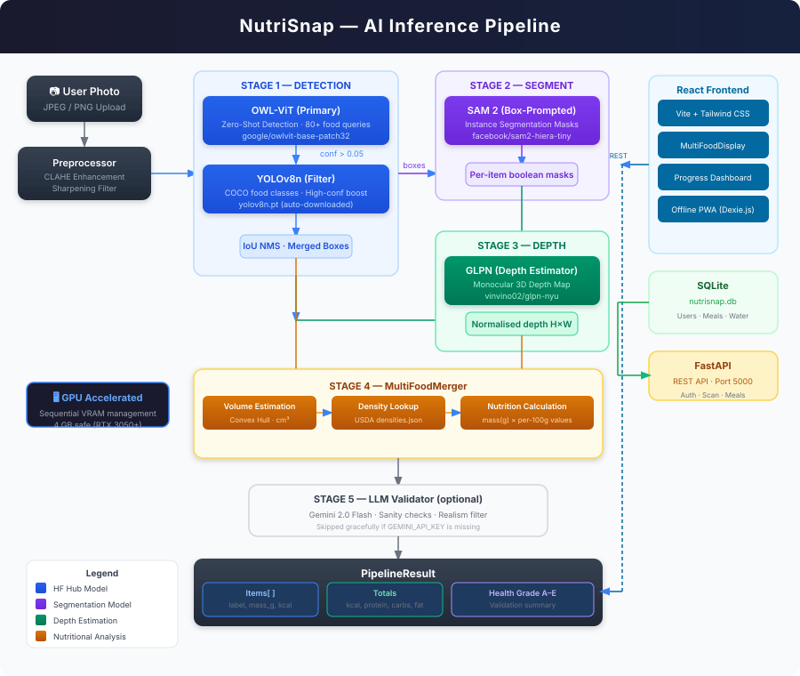

# NutriSnap 🍱

**AI-powered nutrition companion for personalized fitness and healthy living.**

NutriSnap is a comprehensive nutrition tracking platform that uses an advanced AI ensemble to estimate calories and macros from a single photo. It combines state-of-the-art computer vision with a personalized user experience, featuring offline-first logging, interactive progress dashboards, and an intelligent meal planner.

---

## 🏗️ Architecture & AI Pipeline



NutriSnap employs a **three-tier, 3D-aware pipeline** to ensure high-accuracy detection and mass estimation even for rare food items or difficult lighting.

### 🧠 The Three-Tier Detection Strategy

1.  **Tier 1: Specialized YOLOv8** — Our primary detector targets common dishes with high speed and precision. If YOLO finds food with confidence > 0.5, we proceed directly to segmentation.
2.  **Tier 2: OWL-ViT Zero-Shot Fallback** — If YOLO fails (e.g., unusual lighting or rare dishes like 'biryani'), the system automatically triggers a Zero-Shot detector using text queries. This ensures we can detect virtually any food type.
3.  **Tier 3: LLM Validation & Realism Check** — All detections are filtered through a Gemini-powered validator to remove non-food items (furniture, pets) and ensure nutritional estimates are physically plausible.

### 🔬 High-Resolution Optimizations

-   **Enhanced Preprocessing**: Every image undergoes automated sharpening and **CLAHE (Contrast Limited Adaptive Histogram Equalization)** to recover texture details from mobile photos.
-   **Tiled Inference**: For high-resolution uploads, the system uses an overlapping tile strategy for Zero-Shot detection, ensuring small food items (like peas in a pulao) are not missed due to downscaling.
-   **Volumetric Reconstruction**: Combines **SAM 2** (Segmentation) and **GLPN** (Depth Estimation) to recover 3D volume from a single 2D photo.

---

## ✨ Key Features

-   **📸 AI Food Scanning**: Real-time nutrition estimation (Calories, Protein, Carbs, Fat) from a single meal photo.
-   **📊 Progress Dashboard**: Interactive visualizations of your 7-day intake and macro distribution using Recharts.
-   **🥗 Meal Planner**: A rule-based engine that suggests personalized recipes based on your real-time nutritional gaps.
-   **🔌 Offline-First (PWA)**: Built with Dexie.js for IndexedDB storage, ensuring the app works perfectly without an internet connection.
-   **🔒 Secure Auth**: JWT-based authentication with Guest User fallback.

---

## 🛠️ Tech Stack

### Backend
-   **Framework**: FastAPI (Python)
-   **AI Engines**: PyTorch, Transformers (SAM 2, GLPN, OWL-ViT), Ultralytics (YOLOv8)
-   **Database**: SQLite (Zero-config, Local Persistence)
-   **Logging**: Loguru

### Frontend
-   **Framework**: React (Vite)
-   **State & Offline**: Dexie.js (IndexedDB)
-   **Charts**: Recharts
-   **Animations**: Framer Motion
-   **Icons**: Lucide React

---

## 🚀 Getting Started

### 1. Prerequisites
-   Node.js 20+
-   Python 3.11+
-   CUDA 12.x (Highly Recommended for AI inference, but CPU is supported)

### 2. Clone and Install Dependencies

```powershell
git clone https://github.com/yourusername/NutriSnap.git
cd NutriSnap

# Setup Backend
cd backend
python -m venv venv
.\venv\Scripts\activate
pip install -r requirements.txt

# Setup Frontend
cd ../frontend
npm install
cd ..
```

### 3. Download AI Model Weights (~1 GB)

NutriSnap relies on several large pre-trained models. To make collaboration easy, we use a setup script that pre-fetches all weights to your local Hugging Face and Ultralytics caches. **You only need to run this once.**

```powershell
# From the backend directory with venv activated:
python scripts/download_models.py
```

### 4. Environment Variables & Credentials
**⚠️ Security Warning**: Never commit your `.env` files to version control.

1. **Backend**: Copy `.env.example` to `.env` in the `backend/` directory:
   ```powershell
   cd backend
   cp .env.example .env
   ```
   Open `backend/.env` and configure:
   - `SECRET_KEY`: Set to a secure random string.
   - `GEMINI_API_KEY`: Required for LLM validation. Get a free key at [Google AI Studio](https://aistudio.google.com/app/apikey).
   - `SKIP_AI_INIT`: Set to `false` to enable real AI inference. Set to `true` if you only want to work on frontend/API without loading heavy ML models.

2. **Frontend**: Create a `.env` file in the `frontend/` directory:
   ```env
   VITE_API_URL=http://localhost:5000
   ```

### 5. Start the Services

The easiest way to start both the frontend and backend simultaneously is to use the `start.py` script in the root directory.

```powershell
# Run from the project root
python start.py
```

Open [http://localhost:5173](http://localhost:5173) in your browser.

*(If you prefer manual startup, run `uvicorn app.main:app --reload --port 5000` in the backend and `npm run dev` in the frontend).*

### 🐳 6. Docker Fallback (Foolproof Setup)

If you have trouble installing Python/Node or configuring environments on your machine, you can run the entire stack using Docker. We have configured a **Development Container Setup** with live-reloading.

```powershell
# 1. Download models first (this is still required locally so Docker can mount them)
python backend/scripts/download_models.py

# 2. Start the entire application
docker-compose up --build
```
- **Live Edit**: You can edit the code in `frontend/` or `backend/` and the Docker containers will automatically restart/hot-reload.
- **GPU Acceleration**: Open `docker-compose.yml` and uncomment the `deploy: resources: ...` section under the backend service if you want to use an NVIDIA GPU inside Docker.

---

## 🔌 API Overview

| Endpoint | Method | Description |
| :--- | :--- | :--- |
| **Auth** |
| `/auth/register` | POST | Register a new user and return JWT. |
| `/auth/login` | POST | Authenticate user and return JWT. |
| **Scan** |
| `/scan/upload` | POST | Upload an image for AI nutrition estimation. Returns task ID. |
| `/scan/status/{id}` | GET | Poll task status and retrieve final prediction. |
| **Meals & Water** |
| `/meals` | POST/GET | Log manual meal entries and retrieve daily history. |
| `/water` | POST/GET | Increment daily water tracking count. |
| **Insights** |
| `/insights/weekly` | GET | Retrieve aggregated weekly calorie and macro trends. |
| **Chat** |
| `/chat/message` | POST | Send a message to the AI nutrition assistant. |

---

## 🌍 Deployment Guides

### Backend (Render / Railway)
The backend is Docker-ready.
1. Deploy as a web service with the Root Directory set to `backend`. 
2. Build Command: `pip install -r requirements.txt`
3. Start Command: `uvicorn app.main:app --host 0.0.0.0 --port $PORT`
4. Add all environment variables from `.env`. Ensure your instance has at least 4GB of RAM (or a GPU).

### Frontend (Vercel)
1. Import into Vercel and set the Framework Preset to **Vite**.
2. Root Directory: `frontend`.
3. Add the `VITE_API_URL` environment variable pointing to your deployed backend URL.

---

## 📄 License
MIT — see [LICENSE](LICENSE) for details.
