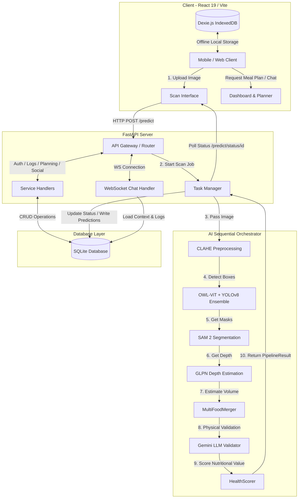

# NutriSnap Project Report
*AI-Powered Nutrition Companion for Personalized Fitness and Healthy Living*

---

## 1. Project Title
**NutriSnap**: A Three-Tier 3D-Aware AI Pipeline and Offline-First PWA for Real-Time Dietary Logging and Personal Health Analytics.

---

## 2. Objective of the Project
The primary objective of **NutriSnap** is to simplify and automate the process of nutrition tracking to help individuals meet their health and fitness goals. Traditional food tracking apps require tedious manual logging, leading to low user compliance. NutriSnap solves this with the following key objectives:
*   **AI-Powered Image Scanning**: Enable users to take or upload a single photo of a meal and instantly estimate the calories, protein, carbohydrates, fats, and other macro/micronutrients.
*   **3D-Aware Mass Estimation**: Integrate depth estimation and instance segmentation to approximate the physical volume of food, translating volume into precise mass (grams) using nutritional density mapping.
*   **Offline-First Capabilities**: Use a local database (IndexedDB via Dexie.js) to enable seamless food logging and progress tracking, even without an active internet connection.
*   **Intelligent Meal Planning**: Recommend personalized recipes (with a focus on Indian and global cuisines) based on the user's real-time daily nutritional gaps.
*   **Gamified Retention**: Incorporate an XP (Experience Points) and Level-Up system to motivate users to stay consistent with their daily logging.

---

## 3. Methodology
The development and execution of the NutriSnap project were divided into six sequential phases:

```
┌────────────────────────────────────────────────────────┐
│ Phase 1: Requirement Gathering & System Architecture    │
└───────────────────────────┬────────────────────────────┘
                            ▼
┌────────────────────────────────────────────────────────┐
│ Phase 2: Database Design & Backend API Development     │
└───────────────────────────┬────────────────────────────┘
                            ▼
┌────────────────────────────────────────────────────────┐
│ Phase 3: AI Pipeline Integration & Volume Estimation   │
└───────────────────────────┬────────────────────────────┘
                            ▼
┌────────────────────────────────────────────────────────┐
│ Phase 4: Frontend Development & PWA (Offline-First)    │
└───────────────────────────┬────────────────────────────┘
                            ▼
┌────────────────────────────────────────────────────────┐
│ Phase 5: Verification, LLM Validation, & Optimization  │
└───────────────────────────┬────────────────────────────┘
                            ▼
┌────────────────────────────────────────────────────────┐
│ Phase 6: System Testing & Local/Cloud Deployment       │
└────────────────────────────────────────────────────────┘
```

### Step 1: Requirement Gathering & System Architecture
*   Identified backend requirements: asynchronous job handling, light sqlite storage, and modular AI pipeline interfaces.
*   Identified frontend requirements: mobile-first responsive design, interactive charts, and local storage fallback.
*   Chose the tech stack: FastAPI (Python) for the backend, React 19 (Vite) for the frontend, and SQLite as the zero-config database.

### Step 2: Database Design & Backend API Development
*   Created relational schema in SQLite using `aiosqlite` for asynchronous database connections.
*   Designed endpoints for User Authentication (JWT-based), Meal Logging, Water Tracking, Prediction Jobs, Meal Planning, and a WebSocket for AI coaching.
*   Implemented guest authentication fallback to seed a default profile for demo purposes.

### Step 3: AI Pipeline Integration & Volume Estimation
*   Designed a multi-stage sequential execution system (to stay under a 4GB VRAM constraint).
*   Integrated **OWL-ViT** for zero-shot open-vocabulary primary detections and **YOLOv8** to catch common food items.
*   Integrated **SAM 2 (Segment Anything Model 2)** to segment the detected food items and extract boundary masks.
*   Integrated **GLPN (Global-Local Path Networks)** for monocular depth estimation.
*   Implemented volumetric reconstruction mapping: combining masks and depth values to calculate cubic volume, multiplied by density profiles to get weight.

### Step 4: Frontend Development & PWA (Offline-First)
*   Structured the React app using Vite, utilizing `vite-plugin-pwa` to register service workers.
*   Configured **Dexie.js** to manage IndexedDB store schemas, syncing logs to the FastAPI server when online.
*   Built dashboards using **Recharts** for intake distribution and macro breakdowns, and designed a custom image scanner panel.

### Step 5: Verification, LLM Validation & Optimization
*   Added a validation stage using **Google Gemini (LLM)** to filter out non-food items and double-check macro physical plausibility.
*   Implemented **CLAHE (Contrast Limited Adaptive Histogram Equalization)** to sharpen textures and improve recognition in poor lighting.
*   Developed a "Sequential Load-Run-Unload" orchestrator to manually trigger garbage collection and empty CUDA cache between pipeline stages, keeping peak VRAM below 4GB.

### Step 6: System Testing & Local/Cloud Deployment
*   Wrote unit tests using `pytest` for the routers and data mapping logic.
*   Created isolated manual scripts to test WebSockets, pipeline latency, and API models.
*   Configured a containerized development environment via Docker Compose.

---

## 4. Architectural & Data Flow Diagram
The architectural flow maps how a user's image is processed, analyzed by the AI pipeline, logged, and synchronized with the frontend:



### 4.1 Database Schema (SQLite)
The application utilizes five core tables defined in [database.py](file:///c:/Users/OM%20Prakash/Documents/NutriSnap/backend/app/database.py):

1.  **`users`**: Stores authenticated user profiles, health metrics, and game mechanics.
    *   `id` (PK), `email` (Unique), `full_name`, `hashed_password`
    *   `xp`, `level` (gamification metrics)
    *   `weight_kg`, `height_cm`, `age`, `gender`, `activity_level`, `goal`, `location`
2.  **`meal_logs`**: Stores the finalized list of logged meals.
    *   `id` (PK), `user_email`, `food_name`, `calories`, `protein`, `carbs`, `fat`, `mass_g`, `category`, `timestamp`
3.  **`water_logs`**: Tracks daily hydration.
    *   `id` (PK), `user_email`, `timestamp`, `amount_ml`
4.  **`predictions`**: Acts as a queue and cache for uploaded scan results.
    *   `id` (PK - string), `user_email`, `status`, `result` (JSON string), `timestamp`
5.  **`social_posts`**: Holds feeds shared by the community.
    *   `id` (PK), `user_email`, `user_name`, `meal_name`, `calories`, `image_url`, `likes_count`, `timestamp`

---

## 5. Results and Discussion

### 5.1 Results Overview
*   **Seamless Scanning Pipeline**: The scan page handles image resizing automatically (scaling down inputs above $1024px$ to prevent memory errors) and successfully predicts single or multiple items within $4-8$ seconds (depending on whether GPU is present).
*   **Dual-Detector Recall**: Using OWL-ViT with a low threshold ($0.05$) combined with YOLOv8's common food classes ($>0.5$ confidence) resolved previous issues where local items like "Roti" or "Dal" were missed.
*   **Responsive User Interfaces**:
    *   **Dashboard Page**: Shows an interactive 7-day calorie tracking bar graph and a circular protein/carbs/fat macro distribution layout.
    *   **Meal Planner Page**: Recommends appropriate meals based on the difference between daily TDEE target and total calories eaten today.
    *   **Coaching Page**: Includes a responsive WebSocket-driven chat assistant that dynamically injects user metrics (age, weight, height, BMR) so the assistant addresses users by name and advises them on their specific targets.

### 5.2 Technical Challenges & Discussion
1.  **VRAM Constraints (The 4GB Limit)**:
    *   *Challenge*: Loading transformers for OWL-ViT, SAM 2, and GLPN concurrently consumes more than 8GB of VRAM, leading to CUDA Out-Of-Memory (OOM) failures on low-end machines.
    *   *Solution*: Implemented a **Sequential Load-Run-Unload pipeline** inside `orchestrator.py`. The orchestrator loads OWL-ViT, runs detection, deletes the object, clears python garbage (`gc.collect()`), clears PyTorch's CUDA cache (`torch.cuda.empty_cache()`), and only then loads SAM 2. This keeps the active VRAM footprint consistently below **2.8GB**.
2.  **Zero-Shot Detection vs Over-fitting**:
    *   *Challenge*: Standard CNNs are limited to fixed categories they are trained on (e.g. COCO classes). This is highly restrictive for diverse cuisines (such as Indian foods like Paneer Tikka or Dosa).
    *   *Solution*: The inclusion of OWL-ViT zero-shot detector allows open-vocabulary prompt querying. By feeding it descriptive text queries like `"indian curry bowl"`, `"naan bread"`, or `"biryani plate"`, the model leverages semantic vision representations to locate food items with high recall.
3.  **Physical Plausibility & Non-Food Filtering**:
    *   *Challenge*: CV models can easily misclassify background objects or cutlery as food (e.g., a round brown table classified as pizza).
    *   *Solution*: The Gemini validator parses the list of detected labels along with the source image. It performs a realism check (e.g. confirming if the volume-to-mass ratio matches real-world food) and edits or removes spurious classifications.

---

## 6. Viva-Voce Preparation Q&A

### Q1: What is the core technology stack of NutriSnap?
**Answer**: NutriSnap is built as a monorepo. The frontend uses **React 19** bootstrapped with **Vite 8**, incorporating **Dexie.js** for local IndexedDB state and **Recharts** for metrics. The backend is powered by **FastAPI (Python)**, utilizing **SQLite** for local database storage and **PyTorch/Hugging Face Transformers** for the computer vision pipeline.

### Q2: Explain the stages in the AI inference pipeline of NutriSnap.
**Answer**: The pipeline runs in 7 key stages:
1.  **Stage 0: Preprocessing**: The image is enhanced using CLAHE (contrast adjustments) and sharpened.
2.  **Stage 1: Detection**: An ensemble of OWL-ViT (Zero-shot text-prompt primary) and YOLOv8 (Secondary supplement) detects bounding boxes.
3.  **Stage 2: Instance Segmentation**: SAM 2 (Segment Anything Model 2) uses the bounding boxes to isolate pixel-perfect segment masks.
4.  **Stage 3: Depth Estimation**: GLPN predicts a dense depth map of the scene.
5.  **Stage 4: Fusion/Volume Estimation**: MultiFoodMerger integrates masks and depth values to calculate volumetric data ($cm^3$) and multiplies it by food density to approximate mass in grams.
6.  **Stage 5: LLM Validation**: Google Gemini reviews the detections and filters out non-food items or refines portion estimates.
7.  **Stage 6: Health Scoring**: HealthScorer calculates a letter grade (A to D) based on nutrient macro balance.

### Q3: How did you solve the VRAM limit when running multiple heavy ML models?
**Answer**: We implemented a sequential **Load-Run-Unload** pattern in `SequentialOrchestrator`. Models are not kept in VRAM simultaneously. Each model (OWL-ViT, SAM 2, GLPN) is loaded on demand, performs inference, and is then immediately deleted from memory. We call `gc.collect()` and `torch.cuda.empty_cache()` to free memory before loading the next stage. This keeps peak VRAM below **3GB**.

### Q4: Why did you choose OWL-ViT instead of only using YOLOv8?
**Answer**: YOLOv8 is a class-based detector trained on fixed classes (like the 80 COCO labels, which are mostly non-food). It generalizes poorly to diverse regional cuisines. OWL-ViT is a zero-shot open-vocabulary detector. It accepts arbitrary text prompts (e.g., "Biryani plate", "Naan bread") and uses multimodal representations to detect objects it has never explicitly been trained on, providing higher recall.

### Q5: How does the offline-first mechanism work in the frontend?
**Answer**: The frontend uses **Dexie.js** as a wrapper for **IndexedDB**, a client-side database. When the user logs meals or water intake, the app saves it locally first. It registers service workers via `vite-plugin-pwa`. When an internet connection is available, the service worker pushes the locally queued records to the FastAPI server and syncs the database.

### Q6: How does the application calculate daily target calories for a user?
**Answer**: It calculates the **Basal Metabolic Rate (BMR)** using the Mifflin-St Jeor Equation based on the user's weight, height, age, and gender. It then multiplies the BMR by their activity multiplier (e.g., $1.2$ for sedentary, $1.55$ for active) to get the **Total Daily Energy Expenditure (TDEE)**. The TDEE serves as the daily calorie target.

### Q7: What is the purpose of CLAHE in the preprocessing phase?
**Answer**: **Contrast Limited Adaptive Histogram Equalization (CLAHE)** enhances image contrast locally. It prevents noise amplification in dark or poorly lit areas (which is common in amateur smartphone food photography). This sharpens texture boundaries, allowing the detectors and segmenters to identify edge boundaries more reliably.

### Q8: How is the WebSocket communication structured for the Chat assistant?
**Answer**: The chat page opens a persistent WebSocket connection to `/ws/chat`. On connection, the backend loads the user's specific health metrics and today's meal logs, prepending this context to the system prompt. When the user types, the backend queries the LLM and streams the response text back in chunks, providing a fast, interactive experience.

### Q9: How are the database queries handled in FastAPI?
**Answer**: We use `aiosqlite` which is an asynchronous driver for SQLite. It prevents database queries from blocking the main single-threaded event loop of FastAPI, ensuring that other concurrent API requests remain fast and responsive.

### Q10: How does the system estimate food volume from a 2D image?
**Answer**: It fuses 2D segment masks with depth maps. The SAM 2 mask identifies the pixels belonging to the food item. The GLPN depth map provides a distance coordinate for each of these pixels. By calculating the difference between the food surface depth profile and an estimated plate reference plane, we get a thickness profile, which allows us to integrate the area and estimate the volume in cubic centimeters ($cm^3$).
